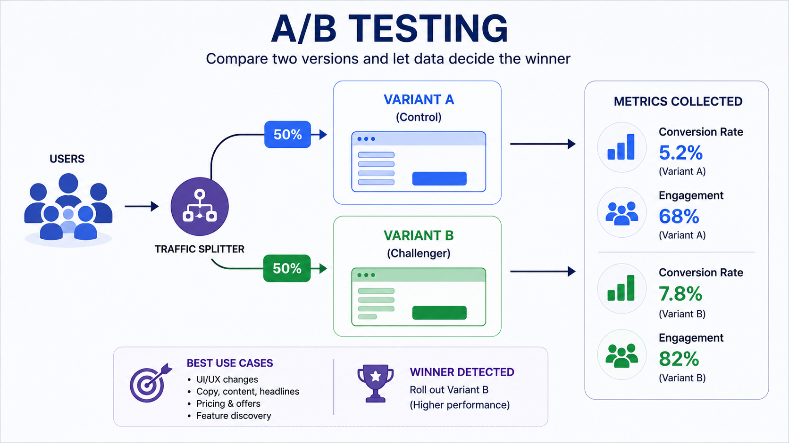
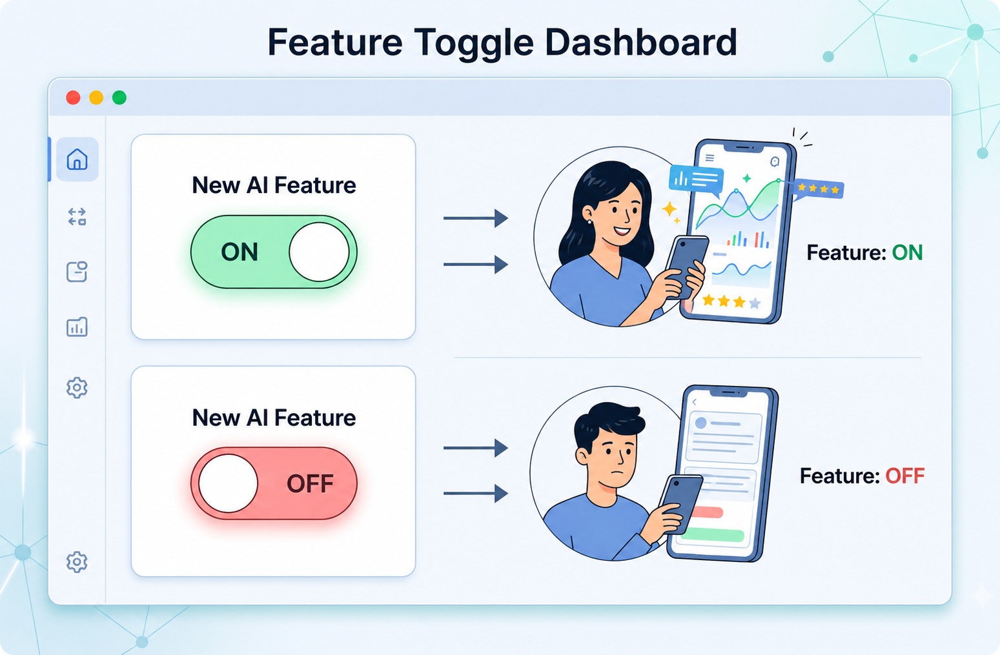
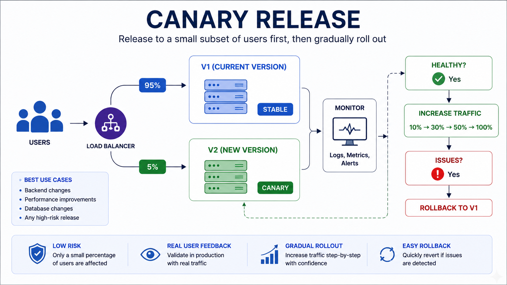
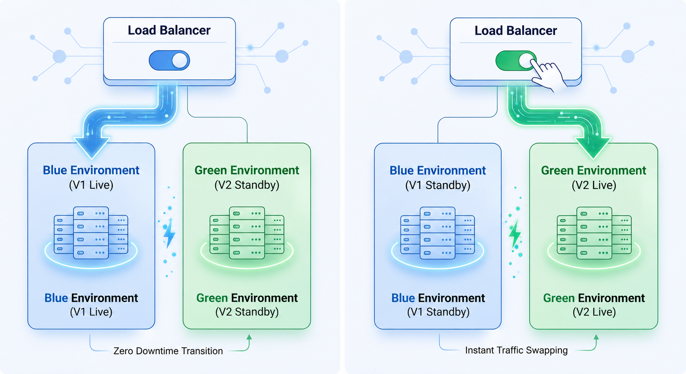
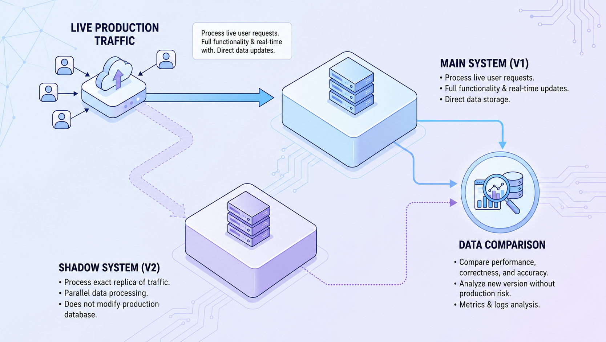
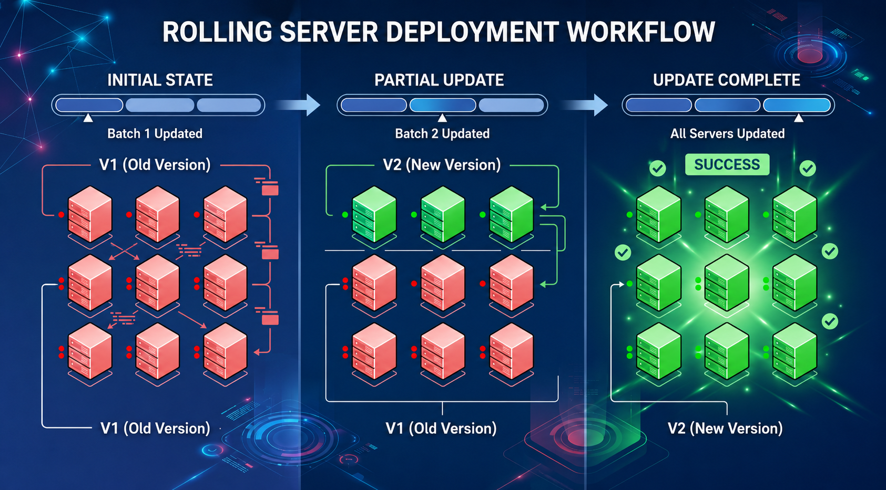
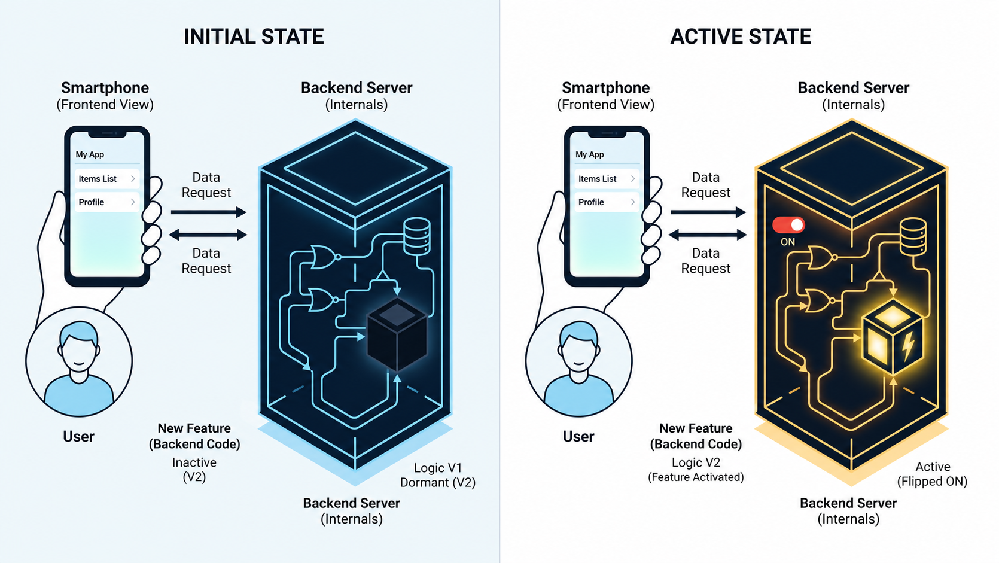
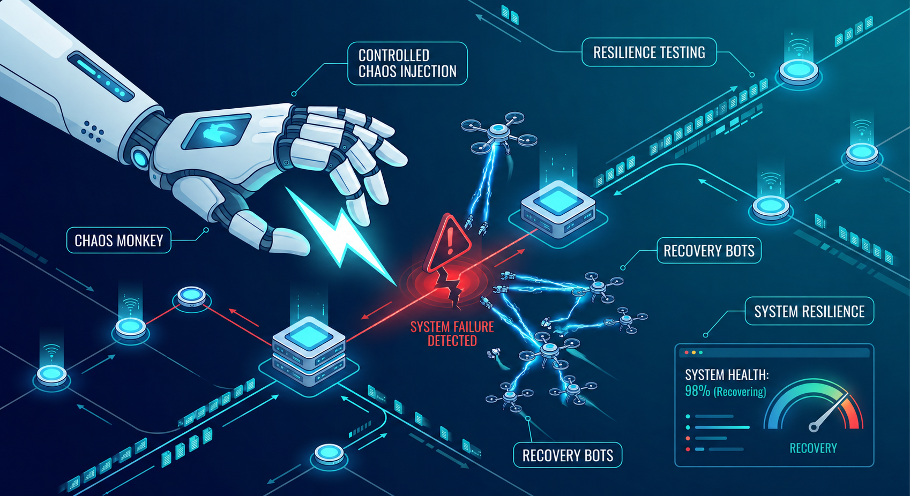

# The Ultimate Guide to Modern Software Deployment & Testing Strategies: How to Release Code Without Breaking Production

## TL;DR

Writing code is the easy part — shipping it safely is where the real engineering begins. This guide covers **eight battle-tested deployment and testing strategies** that modern SaaS companies use to release features, test changes, and catch problems before users notice anything:

1. **A/B Testing** — Split traffic between two variants and let data decide which performs better.
2. **Feature Flags** — Wrap new code in a toggle you can flip on/off without redeploying.
3. **Canary Release** — Route a small slice of live traffic to the new version; expand if healthy, roll back if not.
4. **Blue/Green Deployment** — Maintain two identical environments and switch traffic instantly.
5. **Shadow Testing** — Mirror real production traffic to the new system silently; compare results with zero user risk.
6. **Rolling Deployment** — Update servers one-by-one (or in small batches) so there's always enough capacity online.
7. **Dark Launching** — Deploy backend logic to production while keeping the UI hidden until you're confident.
8. **Chaos Engineering** — Intentionally inject failures to discover weaknesses before real outages happen.

These strategies aren't alternatives — they're **complementary tools** that work best in combination. Start with feature flags and rolling deployments, then layer in canary releases, shadow testing, and chaos engineering as your system matures.

---

## Why This Matters More Than You Think

Picture this. It's 11 PM on a Thursday. Your team just pushed a "small fix" to production. Within minutes, your monitoring dashboard turns red. Users start tweeting complaints. Your CEO Slack-messages you at midnight asking what happened. You roll back, but the damage is done.

Every engineer who has been in the game long enough has a story like this.

Here's the truth most people don't talk about: **writing code is the easy part. Shipping it safely is where the real engineering begins.**

Modern SaaS companies don't just "deploy and pray." They use a toolbox of carefully designed strategies to release features, test changes, and catch problems *before* users notice anything. These strategies aren't theoretical — they're battle-tested practices used by companies like Netflix, Amazon, Stripe, and Spotify every single day.

In this guide, we'll walk through **eight essential deployment and testing strategies** that will change the way you think about releasing software. Each one solves a specific problem, and by the end, you'll know exactly when to reach for which tool.

To make everything crystal clear, we'll use a **single recurring scenario** throughout: imagine your team is **migrating your application's file storage from local AWS EBS volumes to AWS S3**. It's a real-world migration that touches backend logic, performance, cost, and user experience — the perfect playground to understand each strategy.

Let's dive in.

---

## Strategy Comparison: When to Use Which One?

Here's a quick reference table to help you pick the right strategy for your situation:

| Strategy | Primary Goal | Risk Level | User Impact | Infrastructure Cost | Best Use Case |
|---|---|---|---|---|---|
| **A/B Testing** | Product decisions based on data | Low | Intentional (two groups see different versions) | Medium | Comparing UI designs, copy, pricing |
| **Feature Flags** | Dynamic control without redeployment | Low | None (until you flip the switch) | Low | Kill switches, gradual rollouts, per-user targeting |
| **Canary Release** | Risk mitigation with real traffic | Low | Small group at first | Medium | Backend changes, performance updates, critical paths |
| **Blue/Green** | Instant switch and instant rollback | Very Low | None (instant cutover) | High (two full environments) | Major upgrades, zero-downtime requirements |
| **Shadow Testing** | Correctness validation with real data | Very Low | None (users never see the new system) | High | Rewrites, migrations, correctness-critical systems |
| **Rolling Deployment** | Zero-downtime standard updates | Low-Medium | None (gradual server updates) | Low | Routine deployments, containerized workloads |
| **Dark Launching** | Backend testing before UI exposure | Very Low | None (UI is hidden) | Low-Medium | Backend features, API integrations, pre-launch testing |
| **Chaos Engineering** | Resilience and failure preparedness | Medium (controlled) | Possible (run during low-traffic) | Medium | Post-migration validation, DR testing, HA systems |

### Quick Decision Guide

- **"I need to test which design users prefer"** → A/B Testing
- **"I want to deploy code but not activate it yet"** → Feature Flags
- **"I want to release to a small group first and watch for problems"** → Canary Release
- **"I need zero downtime and instant rollback"** → Blue/Green Deployment
- **"I'm rewriting something critical and need to compare results silently"** → Shadow Testing
- **"I just need to update my servers without downtime"** → Rolling Deployment
- **"The backend is ready but the UI isn't"** → Dark Launching
- **"I want to prove my system can survive failures"** → Chaos Engineering

---

## 1. A/B Testing



### The Core Idea

A/B testing is not really a deployment strategy — it's a **decision-making tool**. You release two different versions of a feature to different groups of users and measure which one performs better based on metrics that matter to your business: click-through rates, conversion, engagement, revenue per user.

Think of it like this: a chef is unsure whether customers prefer a spicy sauce or a mild sauce. Instead of guessing, the chef serves both sauces to different tables and watches which one gets more compliments and reorder requests. Data wins over opinions.

### How It Works

1. You create **Variant A** (the current version) and **Variant B** (the new version).
2. You split your traffic — say 50/50 or 80/20.
3. You track **business and UX metrics** for each group.
4. After enough data is collected, you pick the winner.

The key difference from canary deployment: A/B testing is about **gathering data to make a product decision**, not about catching bugs or reducing risk.

### Our Storage Migration Scenario

Your EBS-to-S3 migration is done on the backend. Now you're redesigning the file upload UI. You come up with two designs:

- **Variant A:** A traditional file picker with a separate progress bar below it.
- **Variant B:** A drag-and-drop zone that shows thumbnails instantly as files are added.

You split users 50/50 and measure which design leads to more successful uploads, fewer abandoned uploads, and higher user satisfaction scores. After two weeks, the data shows Variant B has a 23% higher completion rate. You go with Variant B for everyone.

### When to Use A/B Testing

- Comparing two UI designs or UX flows
- Testing pricing page layouts or copy
- Deciding between two feature implementations based on user behavior
- Any situation where **business metrics** should drive the decision, not engineering intuition

---

## 2. Feature Flags (Feature Toggles)



### The Core Idea

A feature flag is like a light switch for your code. You wrap a new feature in a conditional check: if the flag is ON, the new code runs. If it's OFF, the old code runs. The magic? You can flip that switch **without redeploying your application**.

Imagine you're building a house and you install a light fixture in every room. But you don't turn on the lights until the electrician inspects everything and gives the green light. The fixtures are there, wired and ready — but the switch stays off until you say so.

### How It Works

```python
# Pseudocode example
if feature_flags.is_enabled("use_s3_storage"):
    file = save_to_s3(uploaded_file)
else:
    file = save_to_local_ebs(uploaded_file)
```

You deploy this code to production. Nothing changes for users because the flag is OFF. When you're ready, you turn the flag ON — instantly, all requests start going to S3. If something goes wrong, you flip it back OFF. No rollback. No redeployment. No panic.

Feature flags can be as simple as an environment variable or as sophisticated as a full-featured platform like LaunchDarkly, Split, or Unleash — with per-user targeting, percentage rollouts, and scheduled activations.

### Our Storage Migration Scenario

You've written the S3 integration code. It's been tested in staging. But you're not confident enough to switch everyone over. So you:

1. Wrap the S3 logic in a feature flag called `use_s3_storage`.
2. Deploy the code with the flag **OFF**. Everything works as before.
3. Enable the flag for **just your team's internal accounts**. You test with real production data.
4. Enable it for **5% of users**. You monitor.
5. Enable it for **100% of users** when you're satisfied.
6. Remove the flag entirely a few weeks later once S3 is the proven default.

### When to Use Feature Flags

- Deploying code to production but not ready to activate it yet
- Gradually rolling out a feature to users
- Giving customer support the ability to enable features for specific accounts
- Running experiments (pairs well with A/B testing)
- **Kill switches** — instantly disabling a problematic feature without a full rollback

---

## 3. Canary Release / Canary Testing



### The Core Idea

A canary release sends a small slice of your live traffic to the new version of your application while the majority continues using the old version. You watch the canary group closely. If it stays healthy, you increase the traffic. If it gets sick, you pull it back.

The name comes from coal mining. Miners would send a canary down into a mine shaft first. If the canary survived, the air was safe. If the canary showed signs of distress, miners knew to stay out.

### How It Works

1. Deploy the new version alongside the old version.
2. Route **1–5% of traffic** to the new version.
3. Monitor error rates, latency, CPU usage, and business metrics.
4. If healthy, increase traffic: 5% → 10% → 25% → 50% → 100%.
5. If unhealthy, route all traffic back to the old version immediately.

This is different from A/B testing. Canary releases are about **risk mitigation and reliability**, not product decisions. You're not comparing two designs — you're making sure the new version doesn't break things.

### Our Storage Migration Scenario

Your S3 integration is behind a feature flag and ready for real traffic. You configure your load balancer to send **3% of file upload requests** to the S3 code path. The rest continue saving to EBS.

You set up alerts: if the S3 path has an error rate above 1%, or if upload latency increases by more than 200ms, the system automatically routes all traffic back to EBS.

Day 1: 3% — looks clean.
Day 2: 10% — a few timeouts on files over 50 MB. You investigate and find a misconfigured S3 multipart upload setting.
Day 3: After the fix, you go to 25%. Clean.
Day 4: 50%. Clean.
Day 5: 100%. Migration complete in production.

The key insight? If S3 had a critical bug, **only 3% of users would have been affected**, and the system would have auto-reverted. The other 97% would have never noticed.

### When to Use Canary Releases

- Releasing changes that affect backend logic, performance, or data handling
- Any deployment where you want **real production traffic** to validate your changes
- When you need automated rollback based on metrics
- Changes to critical paths: authentication, payments, data storage

---

## 4. Blue/Green Deployment



### The Core Idea

You maintain **two identical production environments**. One is live (serving real users) and the other is idle (waiting for the new version). You deploy your new code to the idle environment, test it thoroughly, and then **flip the traffic switch** from one environment to the other.

Think of it like a theater with two identical stages. The audience is watching Stage A (Blue). Backstage, the crew sets up the next scene on Stage B (Green). When everything is ready, the spotlight switches to Stage B instantly. The audience sees a seamless transition.

### How It Works

1. **Blue environment** is live. All traffic goes to Blue.
2. Deploy the new version to the **Green environment**.
3. Run smoke tests, integration tests, and health checks on Green.
4. When Green is verified, **switch the router/load balancer** to point to Green.
5. Blue becomes the idle standby. If something goes wrong, switch back to Blue instantly.

The switchover is nearly instant — usually just a DNS change or load balancer reconfiguration. Zero downtime. Zero partial states.

### Our Storage Migration Scenario

You have two identical clusters: `app-blue` and `app-green`. Currently, `app-blue` is live and handling all traffic. All files are saved to EBS.

- You deploy the S3-integrated version to `app-green`.
- You run your automated test suite against `app-green`. All 247 tests pass.
- Your QA team manually tests file uploads, downloads, and deletions on `app-green`. Everything works.
- You switch the load balancer from `app-blue` to `app-green`.

Within seconds, all users are now on the S3-powered version. If something was wrong, you'd switch back to `app-blue` in seconds — no rollback, no redeployment, no waiting.

**Important note:** Blue/Green handles the *deployment* side. For the *data* side (switching from EBS to S3), you'd typically combine this with feature flags or canary logic to handle the actual storage migration progressively.

### When to Use Blue/Green Deployment

- When you need **true zero-downtime deployments**
- When you want the ability to **instantly roll back** to the previous version
- When your infrastructure budget supports running two full environments
- When deploying major version upgrades (framework upgrades, runtime changes)
- When your CI/CD pipeline is mature enough to automate the switch

---

## 5. Shadow Testing



### The Core Idea

Shadow testing is the most cautious strategy in this list. You send a **copy of real production traffic** to the new version — but the results are never shown to users. The new version runs silently in the background like a ghost.

Imagine you're a surgeon learning a new technique. Before performing it on real patients, you operate on realistic mannequins that simulate real conditions. You learn and improve without any risk to actual people.

### How It Works

1. All user requests go to the **current system** as normal. Users see results from this system.
2. Each request is **also duplicated and sent to the new system** (the shadow).
3. The shadow system processes the request and produces a result — but **nobody sees it**.
4. You collect and compare results from both systems.
5. Differences reveal bugs, edge cases, or performance issues.

The user never interacts with the new system. There is **zero user-facing risk**. But you get the benefit of testing with **real production data and traffic patterns**.

### Our Storage Migration Scenario

You want to verify that saving files to S3 produces the same results as saving to EBS. Here's your shadow testing setup:

- Every file upload request goes to the **EBS path** (live, users see this).
- The same request is **mirrored to the S3 path** (shadow, logged but not returned to the user).
- A background job compares: Did both paths save the file? Do they return the same file URL? Is the S3 path slower? Are there any file types that fail on S3?

After a week of shadow testing, you discover:

- Files over 100 MB occasionally timeout on S3 (needs multipart upload).
- Files with special characters in their names get renamed differently on S3.
- The S3 path is 40ms slower on average (you optimize the SDK config).

You fix all three issues before a single user ever touches the S3 code path.

### When to Use Shadow Testing

- Migrating critical backend systems (payment processors, database engines, storage)
- Rewriting core algorithms where **correctness must be verified** against the old system
- When the cost of failure is extremely high (financial, medical, legal systems)
- When you need **production-realistic data** but can't risk user impact
- When you have the infrastructure budget to run two systems simultaneously

---

## 6. Rolling Deployment



### The Core Idea

Rolling deployment updates your servers **one at a time** (or in small batches). You take a server out of the pool, update it, put it back, and move to the next one. At any given moment, most of your servers are still serving users.

Think of changing tires on a car while it's driving. You can't stop the car, so you swap one tire at a time while the other three keep things moving. Not perfect, but it works.

Okay, that's a stretch — cars don't work like that. But the idea is: you never take down all your servers at once. You update them gradually, so there's always enough capacity to serve traffic.

### How It Works

1. You have **N servers** running Version 1 behind a load balancer.
2. Take **Server 1** out of the load balancer. Update it to Version 2. Health check it. Put it back.
3. Take **Server 2** out. Update. Health check. Put it back.
4. Repeat until all servers are on Version 2.

If you have 10 servers and update 2 at a time, you always have at least 8 servers handling traffic. Users don't experience downtime.

### Our Storage Migration Scenario

Your application runs on 6 EC2 instances behind an Application Load Balancer. You've already tested the S3 integration in staging and with feature flags. Now you want to deploy the new code.

- **Batch 1:** Drain connections from Instance 1 and 2. Deploy the S3-enabled code. Run health checks. Pass. Add them back to the pool.
- **Batch 2:** Update Instances 3 and 4 the same way.
- **Batch 3:** Update Instances 5 and 6.

Total time: about 15 minutes. At no point were fewer than 4 instances serving traffic. Users experienced zero downtime.

But here's something to watch for: during the rollout, **some instances save to EBS and others save to S3**. This mixed state can cause issues if your application expects all files to be in one place. This is exactly why feature flags pair well with rolling deployments — you deploy the *capability* via rolling update, but activate the *behavior* via a flag once all instances are ready.

### When to Use Rolling Deployment

- Standard application updates where risk is low-to-medium
- When you have multiple servers/containers and want zero downtime
- When you don't need the instant switch of Blue/Green
- When your infrastructure is containerized (Kubernetes does this by default with RollingUpdate strategy)
- When you want the simplest, most resource-efficient deployment method

---

## 7. Dark Launching



### The Core Idea

Dark launching means you **deploy backend functionality to production but keep the UI hidden**. Users can't see or interact with the feature yet, but the backend is live, processing data, and being tested under real conditions.

Imagine a restaurant that's testing a new recipe in the kitchen. The chefs cook it, the kitchen staff taste it, the plating is refined — but it's not on the menu yet. Customers in the dining room have no idea it exists. One day, when the recipe is perfected, it appears on the menu as if it was always there.

### How It Works

1. Build the feature's **backend logic** (API endpoints, data processing, integrations).
2. Deploy it to production — but **do not expose it in the UI**.
3. Use internal tools, scripts, or a small set of API calls to exercise the backend.
4. Monitor performance, errors, and behavior under real production load.
5. When confident, **enable the UI** so users can interact with it.

The goal is to iron out backend issues in the real environment before users ever see the feature. By the time the UI goes live, the backend has been battle-tested for days or weeks.

### Our Storage Migration Scenario

You've built the S3 integration, but you're not ready to switch any real user traffic. Instead, you **dark launch** the S3 storage engine:

- You deploy a new internal API endpoint: `POST /internal/test-s3-upload`.
- A scheduled job runs every 10 minutes, sending test file uploads through the S3 path.
- You monitor S3 upload latency, error rates, and cost.
- You test with file sizes from 1 KB to 500 MB.
- You discover that your S3 bucket policy was blocking cross-region access — and fix it.

After a week of dark launching, your S3 backend has processed over 10,000 test uploads in production. You're confident it works. Now you enable the feature flag in the UI, and users start saving files to S3. But from the backend's perspective, nothing new happened — it had been doing this for a week already.

### When to Use Dark Launching

- Launching major backend features before the UI is ready
- Testing API integrations with third-party services under real load
- Pre-warming caches, database connections, or CDN configurations
- Validating that new backend services can handle production-scale traffic
- When product and engineering timelines are out of sync (backend ready, UI not ready)

---

## 8. Chaos Engineering



### The Core Idea

Chaos engineering is the practice of **intentionally breaking things in your system** to discover weaknesses before they cause real outages. You inject failures — kill a server, disconnect a database, spike the CPU — and observe how your system responds.

Think of it like a fire drill. You don't set a real fire. You simulate the emergency to make sure everyone knows the exit routes, the alarms work, and the response team can react quickly. When a real fire happens, you're prepared.

This isn't about being reckless. It's about **controlled experiments** with clear hypotheses. You predict what should happen, inject the failure, and compare the result with your prediction.

### How It Works

1. Define a **steady state** — what "normal" looks like for your system (e.g., 99.9% uptime, <200ms latency).
2. Form a **hypothesis** — "If the S3 connection fails, the system will fall back to local EBS storage within 5 seconds."
3. **Inject a failure** — block network traffic to S3, kill the S3 SDK process, or simulate an S3 outage.
4. **Observe** — Did the system behave as expected? Did it recover? Did users notice?
5. **Learn and improve** — Fix any weaknesses you discovered.

Tools like **Chaos Monkey** (from Netflix), **Litmus Chaos** (for Kubernetes), and **AWS Fault Injection Simulator** make it easier to run these experiments safely.

### Our Storage Migration Scenario

Your S3 migration is complete. Files are saving to S3. Everything looks stable. But you want to be sure your system is **resilient**. You design a few chaos experiments:

**Experiment 1: S3 becomes unreachable**
- You block outbound traffic to `s3.amazonaws.com` from your application servers.
- You expect: the system falls back to local EBS storage automatically.
- What actually happens: uploads fail with a 30-second timeout before falling back. Users see a loading spinner for 30 seconds.
- Fix: You reduce the S3 client timeout to 3 seconds and add a circuit breaker pattern.

**Experiment 2: S3 returns throttling errors (HTTP 503)**
- You configure your test environment to return 503 errors from S3 randomly.
- You expect: the system retries with exponential backoff.
- What actually happens: the retry logic works, but it retries 10 times, causing 45-second delays.
- Fix: You cap retries at 3 with a max backoff of 5 seconds.

**Experiment 3: An application server crashes mid-upload to S3**
- You kill a server process while it's in the middle of uploading a file.
- You expect: the user sees a clear error message and can retry.
- What actually happens: the user sees a generic "Something went wrong" error with no retry option.
- Fix: You add a retry button and improve the error messaging.

Now your system is genuinely production-ready — not because nothing will ever go wrong, but because you've **already experienced the failures and built defenses against them**.

### When to Use Chaos Engineering

- After a major migration or infrastructure change (exactly like our S3 migration)
- When you need to prove your disaster recovery actually works
- Before a high-traffic event (Black Friday, product launch, conference demo)
- When building highly available systems that must survive partial failures
- As an ongoing practice, not a one-time event (mature teams run chaos experiments weekly)

---

## The Bigger Picture: These Strategies Work Together

Here's something most guides don't tell you: **these strategies are not alternatives to each other. They're complementary tools that work best in combination.**

Going back to our EBS-to-S3 migration, here's how a mature team might combine them:

1. **Dark Launch** the S3 backend. Run it in production with test traffic for a week.
2. **Shadow Test** with real user requests. Compare S3 results with EBS results.
3. Wrap the S3 code path in a **Feature Flag**. Deploy the code with the flag OFF.
4. Enable the flag for 3% of traffic — a **Canary Release**. Monitor everything.
5. **Rolling Deploy** the S3-capable code across all servers.
6. Gradually increase the canary to 100%.
7. Once fully migrated, run **Chaos Engineering** experiments to validate resilience.
8. If you redesigned the upload UI, use **A/B Testing** to pick the best design.

That's not theoretical. That's how real teams ship major infrastructure changes at companies like Stripe, Shopify, and Datadog.

---

## Final Thoughts

Deploying software will always involve risk. You can't eliminate it entirely. But you **can** control it. These strategies exist to give you levers to pull — ways to release code gradually, observe what happens, and pull back if something goes wrong.

Start simple. If you're a small team, **feature flags and rolling deployments** cover 90% of your needs. As your system grows and your user base expands, layer in canary releases and shadow testing for critical changes. Add chaos engineering when uptime becomes a business requirement.

The best deployment strategy is the one your team actually uses consistently. Not the most sophisticated one. Not the one a big tech company blogged about. The one that fits your team's size, budget, and risk tolerance.

Ship carefully. Observe everything. Break things on purpose before they break on their own. That's how you build software that users can trust.

**Happy deploying.**
